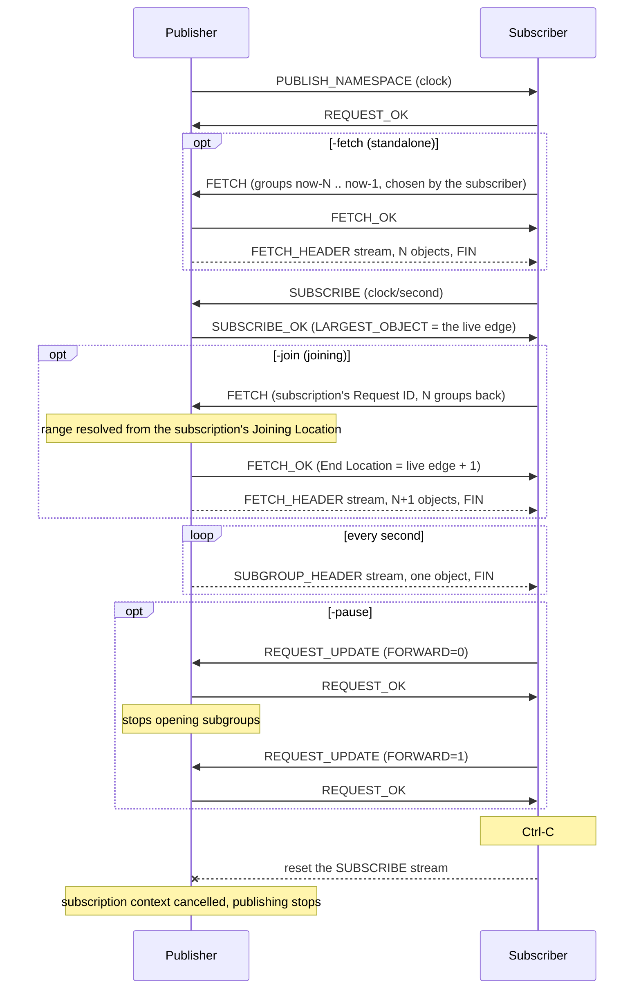

# Example: a date track

A MOQT endpoint serving a track of timestamps. Either side can publish or
subscribe, over native QUIC or WebTransport.

The track has one Object per second: the **Group ID is the Unix time**, and the
single Object in that Group is the second, formatted as RFC 3339. That makes it
deterministic, which is what lets the publisher answer a FETCH for seconds that
have already passed without keeping any history at all.

## Running it

```shell
git clone https://github.com/Eyevinn/moqtransport.git
cd moqtransport/examples/date
```

Publish from the server and subscribe from a client, in two shells:

```shell
go run . -server -publish
go run . -subscribe
```

Or the other way round — the roles are independent of which end listens:

```shell
go run . -server -subscribe
go run . -publish
```

The server always accepts WebTransport at `/moq` on the same port:

```shell
go run . -subscribe -webtransport -addr https://localhost:8080/moq
```

Without `-cert` and `-key` the server generates a throwaway certificate for
localhost, and clients skip verification.

## What each flag demonstrates

| Flag | What it shows |
|---|---|
| `-join 10` | A **joining** FETCH: ten seconds behind the subscription, with the range worked out by the publisher so the two meet exactly |
| `-fetch 10` | A **standalone** FETCH: ten seconds named explicitly by the client, before subscribing |
| `-pause 5s` | A REQUEST_UPDATE turning delivery off and on again, the way a paused player would. The publisher stops sending and says so |
| Ctrl-C on the subscriber | The publisher noticing. draft-18 has no UNSUBSCRIBE: the subscriber resets its request stream, and the publisher's only sign is its subscription's context ending |
| `-trackname minute` | A rejection: the publisher answers DOES_NOT_EXIST rather than dropping the request |
| `-subscribe` on both ends | A nil handler answering NOT_SUPPORTED, which is a real answer rather than silence |

```shell
# Subscribe, then fill four seconds behind the live edge.
go run . -subscribe -join 4

# Fetch four seconds explicitly, then subscribe.
go run . -subscribe -fetch 4

# Subscribe, pause after three seconds, resume three seconds later.
go run . -subscribe -pause 3s
```

### The two kinds of FETCH

Both retrieve Objects that already exist. The difference is who decides the
range, and it is the whole reason the joining form exists.

`-fetch N` is a **standalone** FETCH: the client picks a range and asks for it.
It runs before the SUBSCRIBE, so where the range should stop is a guess — the
client does not learn where the live edge is until SUBSCRIBE_OK tells it, which
is after the fetch has already been sent. This one guesses "up to a second
ago", and is reliably one short:

```
fetched group 1788080296: 2026-08-30T08:58:16Z
fetched group 1788080297: 2026-08-30T08:58:17Z
fetched group 1788080298: 2026-08-30T08:58:18Z
subscribed, live edge is group 1788080299          <- never delivered
received group 1788080300: 2026-08-30T08:58:20Z
```

A better guess would narrow the gap, and against this particular track — a
clock, on a machine whose time agrees with the publisher's — the client could
even compute the right answer. Against a real track it cannot: only the
publisher knows where the edge is, and it keeps moving while the two requests
are in flight.

`-join N` is a **joining** FETCH: the client names the subscription and how far
back to go, and the publisher works out the rest from that subscription's
Joining Location. The two are contiguous by construction — nothing missing at
the join point, and nothing delivered twice.

```
subscribed, live edge is group 1788080171
joining fetch accepted, ends at group 1788080171
joined  group 1788080167: 2026-08-30T08:56:07Z
joined  group 1788080168: 2026-08-30T08:56:08Z
joined  group 1788080169: 2026-08-30T08:56:09Z
joined  group 1788080170: 2026-08-30T08:56:10Z
joined  group 1788080171: 2026-08-30T08:56:11Z    <- the live edge itself
received group 1788080172: 2026-08-30T08:56:12Z   <- and straight on from it
```

That property is what the test asserts: the Group IDs across the fetch and the
subscription form one consecutive run.

The publisher does not have to know which kind it answered. A joining FETCH
reaches the handler with its Namespace, Track and range already resolved
against the subscription it names, so `handleFetch` serves both the same way;
`FetchRequest.Joining` is there only to say which it was.

## How it talks



Each announcement, subscription and fetch is a bidirectional stream of its own,
and Objects travel on unidirectional streams. Nothing is correlated by Request
ID at the API level: the stream is the request.

## Tests

`go test ./examples/date/` runs the example against itself over a real QUIC
stack — both transports, both kinds of FETCH, the contiguity of a joining
fetch with its subscription, and a rejection. It is the only place
the transport adapters, the TLS ALPN and the WebTransport subprotocol are
exercised, so it takes a few seconds by construction: the track publishes once
a second.
