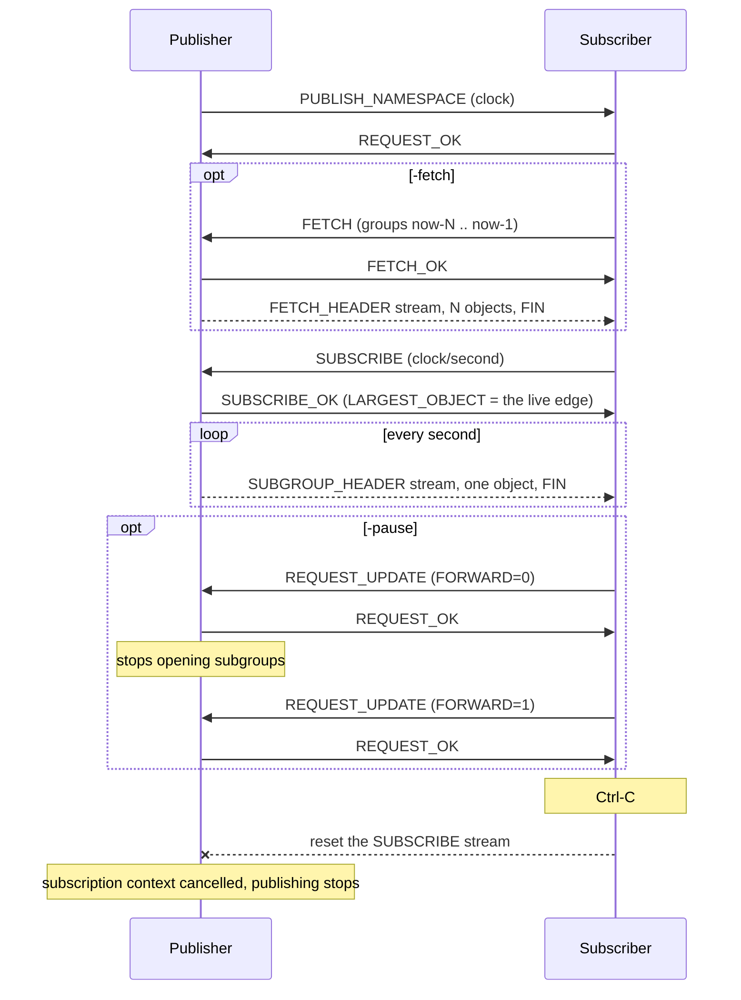

# Example: a date track

A MOQT endpoint serving a track of timestamps. Either side can publish or
subscribe, over native QUIC or WebTransport.

The track has one Object per second: the **Group ID is the Unix time**, and the
single Object in that Group is the second, formatted as RFC 3339. That makes it
deterministic, which is what lets the publisher answer a FETCH for seconds that
have already passed without keeping any history at all.

## Running it

```shell
git clone https://github.com/Eyevinn/moqtransport.git
cd moqtransport/examples/date
```

Publish from the server and subscribe from a client, in two shells:

```shell
go run . -server -publish
go run . -subscribe
```

Or the other way round — the roles are independent of which end listens:

```shell
go run . -server -subscribe
go run . -publish
```

The server always accepts WebTransport at `/moq` on the same port:

```shell
go run . -subscribe -webtransport -addr https://localhost:8080/moq
```

Without `-cert` and `-key` the server generates a throwaway certificate for
localhost, and clients skip verification.

## What each flag demonstrates

| Flag | What it shows |
|---|---|
| `-fetch 10` | A FETCH for the last ten seconds before subscribing, the way a player fills a buffer before joining a live stream |
| `-pause 5s` | A REQUEST_UPDATE turning delivery off and on again, the way a paused player would. The publisher stops sending and says so |
| Ctrl-C on the subscriber | The publisher noticing. draft-18 has no UNSUBSCRIBE: the subscriber resets its request stream, and the publisher's only sign is its subscription's context ending |
| `-trackname minute` | A rejection: the publisher answers DOES_NOT_EXIST rather than dropping the request |
| `-subscribe` on both ends | A nil handler answering NOT_SUPPORTED, which is a real answer rather than silence |

```shell
# Fetch four seconds of history, then follow the live edge.
go run . -subscribe -fetch 4

# Subscribe, pause after three seconds, resume three seconds later.
go run . -subscribe -pause 3s
```

## How it talks



Each announcement, subscription and fetch is a bidirectional stream of its own,
and Objects travel on unidirectional streams. Nothing is correlated by Request
ID at the API level: the stream is the request.

## Tests

`go test ./examples/date/` runs the example against itself over a real QUIC
stack — both transports, the fetch path, and a rejection. It is the only place
the transport adapters, the TLS ALPN and the WebTransport subprotocol are
exercised, so it takes a few seconds by construction: the track publishes once
a second.
